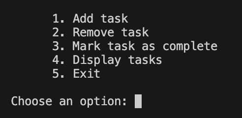
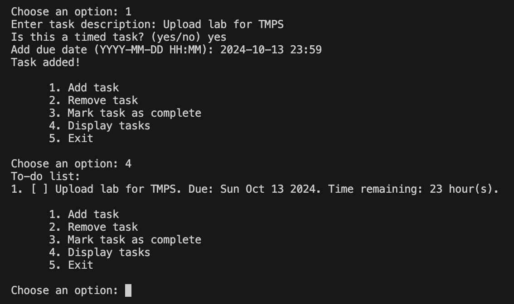
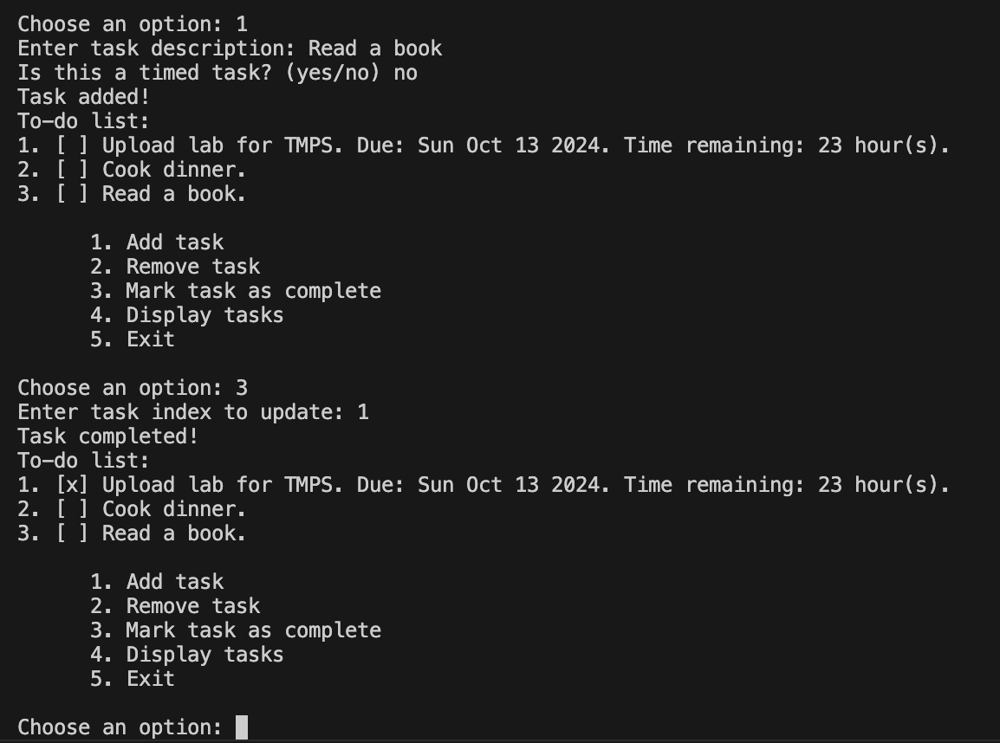
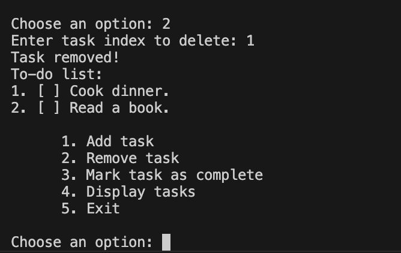
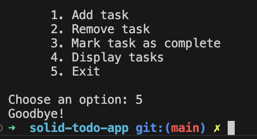

# Laboratory 0 - Simple Task Management System

## Author: Maria Colta

---

## Objectives:

- Implement 2 SOLID letters in a simple project.

## Implementation

This is a simple task management project that allows users to add, remove and complete tasks, with the option to add a deadline. This project implements two principles from the SOLID: the Single Responsibility Principle (SRP) and the Open-Closed Principle (OCP).

### Single Responsability Principle (SRP)

Single Responsability Principle states that a class should have one and only one reason to change, meaning it should have only one job or responsibility.

In this project, this principle can be seen in various examples:

- `Task` and `TimedTask` represent different types of tasks. `Task` handles general task functionality (description, completion status), and `TimedTask` extends `Task` and adds deadline-specific logic.
- `TaskManager` is responsabile to handle the collection of tasks (adding, removing, and marking tasks as complete). It doesn’t care about how tasks are displayed or how the user interacts with the system.
- `TaskCreator`, `BasicTaskCreator` and `TimedTaskCreator` are responsible just for creation of specific types of tasks. Each creator class is responsible for creating specific types of tasks, without dealing with task management or UI logic.
- `UIHandler` and `MenuHandler` are responsible only for user interaction and display logic.

#### Code Examples

```typescript
export class Task {
  private description: string;
  private isCompleted: boolean;

  constructor(description: string, isCompleted: boolean = false) {
    this.description = description;
    this.isCompleted = isCompleted;
  }

  getDescription(): string {
    return this.description;
  }

  setDescription(desc: string): void {
    this.description = desc;
  }

  getCompleted(): boolean {
    return this.isCompleted;
  }

  setCompletion(isCompleted: boolean): void {
    this.isCompleted = isCompleted;
  }
}
```

This class implements all methods that are relevant to all types of tasks. Other classes that extend `Task` will implement additional functionality relevant to the desired type. For example, `TimedTask` extends this class and adds methods to handle the due date for the deadline.

```typescript
export class TimedTask extends Task {
  private dueDate: Date;

  constructor(
    description: string,
    dueDate: Date,
    isCompleted: boolean = false
  ) {
    super(description, isCompleted);
    this.dueDate = dueDate;
  }

  getDueDate(): Date {
    return this.dueDate;
  }

  setDueDate(date: Date) {
    this.dueDate = date;
  }

  timeRemaining(): string {
    // logic implementation to calculate remaining time till dueDate
  }
}
```

Implementation for `TaskManager` class:

```typescript
export class TaskManager {
  private tasks: Task[] = [];

  constructor(tasks: Task[]) {
    this.tasks = tasks;
  }

  addTask(task: Task): void {
    this.tasks.push(task);
  }

  removeTask(index: number): void {
    this.tasks.splice(index, 1);
  }

  completeTask(index: number): void {
    if (this.tasks[index]) {
      this.tasks[index].setCompletion(true);
    }
  }

  listTasks(): Task[] {
    return this.tasks;
  }
}
```

### Open-Closed Principle (OCP)

The Open-Closed Principle states that software entities (classes, modules, functions, etc.) should be open for extension but closed for modification. We should be able to add new functionality to existing code without altering its source.

In this project, implementation of OCP can be seen in the following case:

- `TaskCreator` - allows us to extend the task creation process by adding new types of task creators without changing the existing code.

- Also it can be seen again with the classes `Task` and `TimedTask`, since we simply extend the `Task` class in order to achieve new functionality, without changing the code.

#### Code Example

```typescript
export abstract class TaskCreator {
  public abstract taskFactory(params: TaskCreationParams): Task;

  public createTask(params: TaskCreationParams) {
    return this.taskFactory(params);
  }
}
```

`TaskCreator` is an abstract class that defines the blueprint for creating different types of tasks. It implements the Factory Method pattern, and it uses the `TaskCreationParams` interface for necessary parameters for task creation.

Each specific task type (e.g., `BasicTask`, `TimedTask`) is created by extending `TaskCreator` and implementing the `taskFactory` method.

```typescript
export interface TaskCreationParams {
  description: string;
  dueDate?: Date;
  isComplete?: boolean;
}
```

```typescript
export class BasicTaskCreator extends TaskCreator {
  public taskFactory(params: TaskCreationParams): Task {
    return new Task(params.description);
  }
}
```

```typescript
export class TimedTaskCreator extends TaskCreator {
  public taskFactory(params: TaskCreationParams): TimedTask {
    if (!params.dueDate) {
      throw new Error("TimedTask requires a due date.");
    }
    return new TimedTask(params.description, params.dueDate);
  }
}
```

This approach allows for adding new task types without changing the existing code. By extending `TaskCreationParams` with additional properties when needed, the task creation process remains flexible and extensible without changing the core logic.

##### Example of usage:

Pseudocode of `createTask` method from `UIHandler` class:

```typescript
createTask(callback):

    ask "Enter task description"
        ask "Is this a timed task? (yes/no)"

        if "yes":
            taskCreator = new TimedTaskCreator();
            ask "Add due date (YYYY-MM-DD HH:MM)"
            if valid date:
                // create task with description and dueDate using taskCreator

        else:
            taskCreator = new BasicTaskCreator()
            //create task with description using taskCreator

    callback()
```

## Screenshots / Results

When running the project, the first thing in the output is the menu with possible options to choose:



For example, the user adds tasks to the list. Then the promt asks to add a description, and specify the type of task (timed or not). If the task is timed, then the user has to add the due date according to the format. After that the task is added and we can see it in the list by choosing option 4.



I added a few more tasks to the list to have more examples to work with. The user can also mark a task as completed with option 3, and the task is displayed with `[x]`, as completed.



There is also the possibility to remove a task from the list by choosing oprion 2.



And in the end, to exit the system.



## Conclusions

This simple project of task management system follows two key SOLID principles: the **Single Responsibility Principle** and **Open-Closed Principle**. By making sure that each class has a single, clear responsibility, the project stays organized and easy to manage.

The SRP ensures that changes in one part of the system don’t affect others, while the OCP makes it easy to add new features—like different types of tasks—without changing the existing code.

Overall, this project successfully meets its goals of task creation and management. While working on it, I've realized again how important it is to apply good design principles to build a more flexible and maintainable system.
