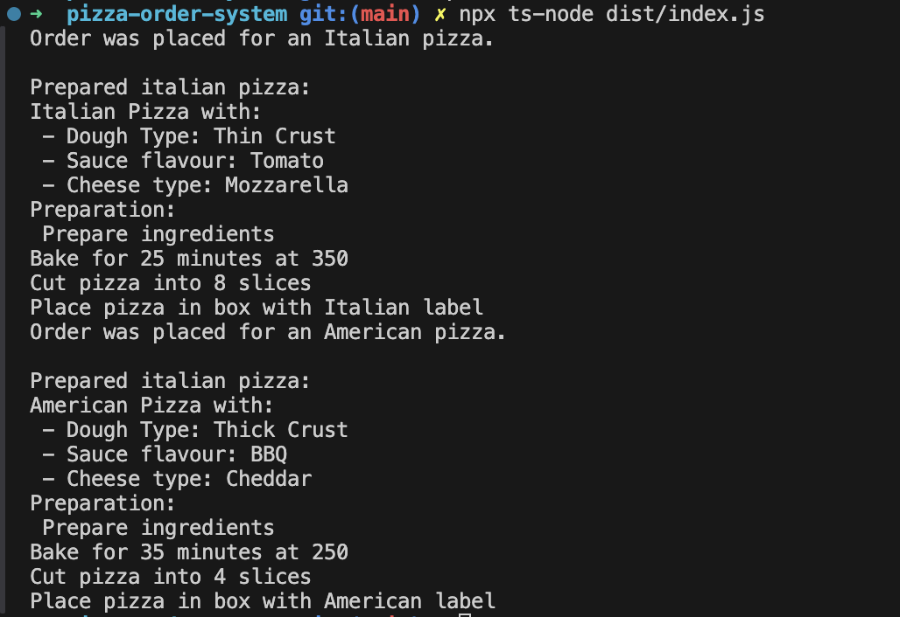

# Laboratory 1 - Pizza Ordering System

## Author: Maria Colta

---

## Objectives:

1. Select a domain area for the sample project.

2. Define the main involved classes and think about what instantiation mechanisms are needed.

3. Based on the previous point, implement at least 3 creational design patterns in your project.

## Theory

Creational design patterns provide various creation mechanisms, which increase flexibility and reuse of existing code. They are composed of two dominant ideas. One is encapsulating knowledge about which concrete classes the system uses. Another is hiding how instances of these concrete classes are created and combined.
Examples of creational patterns are: [1]

- **Singleton Pattern** - creational design pattern that lets you ensure that a class has only one instance, while providing a global access point to this instance. [2]

- **Abstract Factory** - creational design pattern that lets you produce families of related objects without specifying their concrete classes. [2]

- **Builder** - creational design pattern that lets you construct complex objects step by step. The pattern allows you to produce different types and representations of an object using the same construction code. [2]

- **Prototype** - creational design pattern that lets you copy existing objects without making your code dependent on their classes. [2]

- **Factory Method** - creational design pattern that provides an interface for creating objects in a superclass, but allows subclasses to alter the type of objects that will be created. [2]

## Implementation & Used Design Patterns:

I decided to do a simple project which represents a pizza ordering system.

Instructions to run the project: [Run Project](#run-the-project)

The design patterns that I used are:

### 1. Singleton

Here, I used Singleton pattern to manage the ordering system, ensuring that there is only one instance responsible for processing orders. I achieved this by creating the class `PizzaOrderSystem`, which has a static method `getInstance()` that returns the single instance of `PizzaOrderSystem`. When a pizza is created, it is passed to this singleton for final processing, simulating a centralized order handling mechanism.

Here is the code example:

```typescript
export class PizzaOrderSystem {
  private static instance: PizzaOrderSystem;

  private constructor() {}

  static getInstance(): PizzaOrderSystem {
    if (!PizzaOrderSystem.instance) {
      PizzaOrderSystem.instance = new PizzaOrderSystem();
    }
    return PizzaOrderSystem.instance;
  }

  placeOrder(order: Order): void {
    console.log(`${order.getOrderDetails()}`);
  }
}
```

### 2. Abstract Factory

I used Abstract Factory to create families of related pizza ingredients based on the pizza style (e.g. in my case, Italian or American). To implement Abstract Factort, I created an intreface `PizzaIngredientsFactory`, which defines methods to create veriious ingredients (such as `Dough`, `Cheese` and `Sauce`). Then there are two concrete factories `ItalianIngredientFactory` and `AmericanIngredientFactory`, which implement the interface to produce specific ingredient variants for Italian and American pizzas, respectively.

Here is the code snippets:

```typescript
export interface PizzaIngredientsFactory {
  createDough(): Dough;
  createSauce(): Sauce;
  createCheese(): Cheese;
}
```

```typescript
export class ItalianIngredientsFactory implements PizzaIngredientsFactory {
  createDough(): Dough {
    return new ThinCrustDough();
  }

  createSauce(): Sauce {
    return new TomatoSauce();
  }

  createCheese(): Cheese {
    return new MozzarellaCheese();
  }
}
```

```typescript
export class AmericanIngredientsFactory implements PizzaIngredientsFactory {
  createDough(): Dough {
    return new ThickCrustDough();
  }

  createSauce(): Sauce {
    return new BBQSauce();
  }

  createCheese(): Cheese {
    return new CheddarCheese();
  }
}
```

These factories are then used inside builders, to create the appropriate ingredients for the selected pizza style.

### 3. Builder

The Builder Pattern is used to construct different types of pizzas step-by-step, allowing for customization based on the order.

I have two concrete builder classes `ItalianPizzaBuilder` and `AmericanPizzaBuilder` which create the respective pizzas. Each builder uses a specific ingredient factory to create the right ingredients, and then assemble the pizza step-by-step, ensuring that the ingredients match the selected pizza type.

Both classes implement the `PizzaBuilder` interface:

```typescript
export interface PizzaBuilder {
  prepare(ingredientsFactory: PizzaIngredientsFactory): void;
  bake(): string;
  cut(): string;
  box(): string;
}
```

Here is an example of implemented `ItalianPizzaBuilder` class:
(the full code can be seen here [Full `ItalianPizzaBuilder` code](Lab1/pizza-order-system/src/builders/ItalianPizzaBuilder.ts))

```typescript
export class ItalianPizzaBuiler implements PizzaBuilder {
  private ingredientsFactory: ItalianIngredientsFactory;
  private dough!: Dough;
  private sauce!: Sauce;
  private cheese!: Cheese;

  constructor(ingredientsFactory: ItalianIngredientsFactory) {
    this.ingredientsFactory = ingredientsFactory;
  }

  prepare(): string {
    this.dough = this.ingredientsFactory.createDough();
    this.sauce = this.ingredientsFactory.createSauce();
    this.cheese = this.ingredientsFactory.createCheese();

    return `--Ingredients for Italian Pizza-- \n 1. ${this.dough.getDetails()} \n 2. ${this.sauce.getDetails()} \n 3. ${this.cheese.getDetails()}`;
  }

  bake(): string {}
  cut(): string {}
  box(): string {}

  finalPizza(): Pizza {
    this.prepare();

    const pizza = new Pizza({
      type: "Italian",
      dough: this.dough,
      sauce: this.sauce,
      cheese: this.cheese,
    });

    return pizza;
  }
}
```

To see the implementation of all these classes, I have the following client code example:

```typescript
const orderSystem = PizzaOrderSystem.getInstance(); // create instance of PizzaOrderInstance to manage all orders in one place

// initialize ingredient factories for each pizza type
const italianFactory = new ItalianIngredientsFactory();
const americanFactory = new AmericanIngredientsFactory();

// place order for italian pizza
const italianOrder = new Order("Italian");
orderSystem.placeOrder(italianOrder);

// create builder and use the necessary ingredients
const italianPizzaBuilder = new ItalianPizzaBuiler(italianFactory);
const italianPizza = italianPizzaBuilder.finalPizza(); // get the final pizza
console.log("Prepared italian pizza: ");
console.log(italianPizza.getFullDescription());

// same process for another pizza type
const americanOrder = new Order("American");
orderSystem.placeOrder(americanOrder);

const americanPizzaBuilder = new AmericanPizzaBuilder(americanFactory);
const americanPizza = americanPizzaBuilder.finalPizza();
console.log("Prepared italian pizza: ");
console.log(americanPizza.getFullDescription());
```

In the client code, the client doesn’t need to worry about which ingredients are needed for each pizza type or the steps to make it. The creational patterns handle all of that behind the scenes. If we want to add new pizza types, we just need to create new classes that implement the `PizzaBuilder` interface and a corresponding `PizzaIngredientsFactory` for the ingredients. This makes it easy to expand the system without changing existing code.

## Run the project

To run the project, run the following commands:

```
cd Lab1/pizza-order-system
npm install
```

Compile the `.ts` files and run the `index.js` file:

```
npx tsc
npx ts-node dist/index.js
```

## Screenshots / Results

When running the project, we have the following output, based on the instructions from client code:



## Conclusions

The three design patterns, Singleton, Abstract Factory, and Builder, work together to make the pizza ordering system easy to use, flexible, and well-organized. Each pattern has a specific role: the Singleton Pattern manages all orders in one place, the Abstract Factory Pattern picks the right ingredients based on the pizza type, and the Builder Pattern assembles the pizza step-by-step. This approach shows how these design patterns can be used together in a simple project, making the code reusable and allowing for easy addition of new pizza types in the future.

## Bibliiography

[1] https://refactoring.guru/design-patterns/creational-patterns
[2] https://en.wikipedia.org/wiki/Creational_pattern
