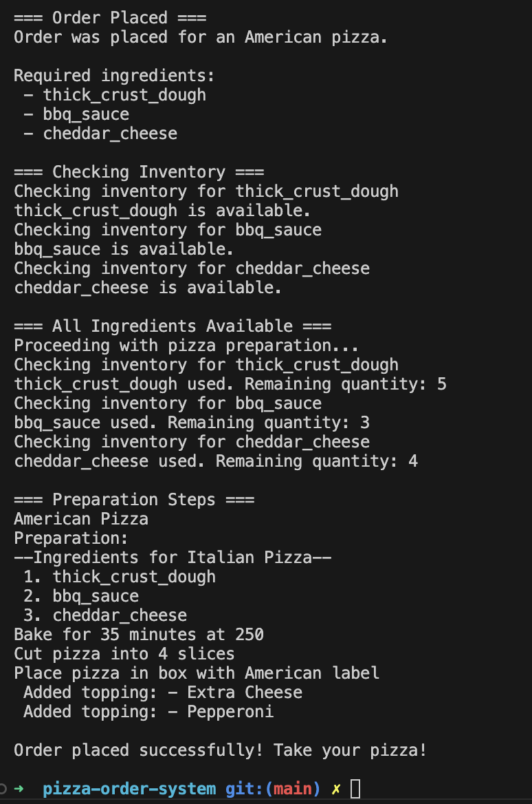

# Laboratory 2 - Pizza Ordering System 2

## Author: Maria Colta

---

## Objectives:

1. Study and understand the Structural Design Patterns.

2. As a continuation of the previous laboratory work, think about the functionalities that your system will need to provide to the user.

3. Implement some additional functionalities using structural design patterns.

## Theory

Structural Design Patterns are solutions in software design that focus on how classes and objects are organized to form larger, functional structures. These patterns help developers simplify relationships between objects, making code more efficient, flexible, and easy to maintain. By using structural patterns, we can better manage complex class hierarchies, reuse existing code, and create scalable architectures. [1]

Here are some examples of structural design patterns:

- **Proxy** - lets you provide a substitute or placeholder for another object. A proxy controls access to the original object, allowing you to perform something either before or after the request gets through to the original object. [2]

- **Decorator** - lets you attach new behaviors to objects by placing these objects inside special wrapper objects that contain the behaviors. [2]

- **Facade** - provides a simplified interface to a library, a framework, or any other complex set of classes. [2]

- **Adapter** - that allows objects with incompatible interfaces to collaborate. [2]

- **Bridged** - lets you split a large class or a set of closely related classes into two separate hierarchies—abstraction and implementation—which can be developed independently of each other. [2]

- **Composite** - lets you compose objects into tree structures and then work with these structures as if they were individual objects. [2]

- **Flyweight** - lets you fit more objects into the available amount of RAM by sharing common parts of state between multiple objects instead of keeping all of the data in each object.

## Implementation & Used Design Patterns:

The strucural patterns which I used to continue the pizza ordering system are described below in the next subsections.

The instructions to run the project can be found here: [Run Project](#run-the-project)

### 1. Proxy

I used the Proxy pattern to manage access to the inventory system, which tracks whether ingredients are available for a pizza order. The `InventoryProxy` class checks ingredient stock when an order is placed, acting as an intermediary between the ordering system and the `RealInventoryService`. Both classes implement the `InventoryService` interface.

The `RealInventoryService` simulates a connection to a data source that holds ingredient stock. In this case, I used a JSON file (found in the `data` folder) to represent ingredient quantities.

Here are the corresponding code snippets:

```typescript
export interface InventoryService {
  isIngredientAvailable(ingredient: string): boolean;
  useIngredient(ingredient: string): void;
}
```

```typescript
export class RealInventoryService implements InventoryService {
  private inventory: { [ingredient: string]: number };

  constructor() {
    this.inventory = this.loadInventory();
  }

  private loadInventory(): { [ingredient: string]: number } {
    // parses data from inventory.json file
  }

  isIngredientAvailable(ingredient: string): boolean {
    // checks if ingredient can be used
  }

  useIngredient(ingredient: string): void {
    // implemetation for using needed ingredient
  }

  private updateInventory(): void {
    // updates information about the used ingredient in the file
  }
}
```

```typescript
export class InventoryProxy implements InventoryService {
  private realInventoryService: RealInventoryService;
  private ingredientCache: Map<string, boolean>;

  constructor() {
    this.realInventoryService = new RealInventoryService();
    this.ingredientCache = new Map();
  }

  isIngredientAvailable(ingredient: string): boolean {
    if (!this.ingredientCache.has(ingredient)) {
      const available =
        this.realInventoryService.isIngredientAvailable(ingredient);
      this.ingredientCache.set(ingredient, available);
    }
    return this.ingredientCache.get(ingredient) as boolean;
  }

  useIngredient(ingredient: string): void {
    this.realInventoryService.useIngredient(ingredient);
    this.ingredientCache.delete(ingredient);
  }
}
```

Here, the `InventoryProxy` class controls and caches ingredient availability, which reduces the need for direct calls to the inventory system, improving performance.

### 2. Decorator

The Decorator pattern allows us to add optional toppings to the pizza without changing the core `Pizza` class.

I created an abstract class PizzaDecorator that extends `Pizza`. This allows specific decorators like `ExtraCheese` or `Pepperoni` to wrap a `Pizza` instance and add their unique characteristics. This setup allows for any number of decorators to be added to the pizza.

Here are simple code snippets for decorators:

```typescript
export abstract class PizzaDecorator extends Pizza {
  protected pizza: Pizza;

  constructor(pizza: Pizza) {
    super({
      type: pizza.type,
      dough: pizza.dough,
      sauce: pizza.sauce,
      cheese: pizza.cheese,
    });
    this.pizza = pizza;
  }

  getFullDescription(): string {
    return this.pizza.getFullDescription();
  }
}
```

```typescript
export class Pepperoni extends PizzaDecorator {
  getFullDescription(): string {
    return `${this.pizza.getFullDescription()}\n Added topping: - Pepperoni`;
  }
}
```

```typescript
export class ExtraCheese extends PizzaDecorator {
  getFullDescription(): string {
    return `${this.pizza.getFullDescription()}\n Added topping: - Extra Cheese`;
  }
}
```

With these decorators, the main `Pizza` instance can be customized dynamically with different toppings. The next section will show how these classes are applied in practice.

### 3. Facade

The Facade pattern is used to make the pizza ordering process simple for the client. The `PizzaOrderFacade` class hides the complexities of ordering and preparing a pizza, allowing clients to select a pizza type, add toppings, and place an order without needing to know the inner workings of the system.

Here is the class which implements the facade pattern:

```typescript
export class PizzaOrderFacade {
  private inventory: InventoryProxy;
  private orderType: "Italian" | "American" | null = null;
  private toppings: ((pizza: Pizza) => PizzaDecorator)[] = [];

  constructor() {
    this.inventory = new InventoryProxy();
  }

  public choosePizzaType(type: "Italian" | "American") {
    this.orderType = type;
  }

  public addTopping(decorator: (pizza: Pizza) => PizzaDecorator) {
    this.toppings.push(decorator);
  }

  public getPizza() {
    if (!this.orderType) {
      console.log("Please select a pizza type before placing an order.");
      return;
    }

    let builder;
    let order;
    if (this.orderType === "Italian") {
      const ingredientsFactory = new ItalianIngredientsFactory();
      builder = new ItalianPizzaBuiler(ingredientsFactory);
      order = new Order("Italian");
    } else {
      const ingredientsFactory = new AmericanIngredientsFactory();
      builder = new AmericanPizzaBuilder(ingredientsFactory);
      order = new Order("American");
    }

    const pizzaOrderSystem = PizzaOrderSystem.getInstance();

    console.log("=== Order Placed ===");
    pizzaOrderSystem.placeOrder(order);
    console.log("Required ingredients:");

    let pizza = builder.finalPizza();

    const ingredients = [
      pizza.dough.getDetails(),
      pizza.sauce.getDetails(),
      pizza.cheese.getDetails(),
    ];
    ingredients.forEach((ingredient) => {
      console.log(` - ${ingredient}`);
    });

    console.log("\n=== Checking Inventory ===");
    const allAvailable = ingredients.every((ingredient) => {
      const available = this.inventory.isIngredientAvailable(ingredient);
      console.log(
        available
          ? `${ingredient} is available.`
          : `${ingredient} is out of stock!`
      );
      return available;
    });

    if (allAvailable) {
      console.log("\n=== All Ingredients Available ===");
      console.log("Proceeding with pizza preparation...");

      for (const topping of this.toppings) {
        pizza = topping(pizza);
      }

      ingredients.forEach((ingredient) =>
        this.inventory.useIngredient(ingredient)
      );

      console.log("\n=== Preparation Steps ===");
      console.log(pizza.getFullDescription());

      console.log("\nOrder placed successfully! Take your pizza! \n");
    } else {
      console.log("\nNo pizza :(. Some ingredients are out of stock.\n");
    }

    this.orderType = null;
    this.toppings = [];
  }
}
```

The `getPizza()` method in `PizzaOrderFacade` brings together several classes, making the entire ordering process straightforward for the client. It starts by setting up the appropriate `PizzaBuilder` and `PizzaIngredientsFactory` based on the pizza type chosen. Then, it uses the `PizzaOrderSystem` Singleton to handle order placement. Next, `InventoryProxy` checks the availability of ingredients. If ingredients are available, the method continues to prepare the pizza, adding each topping with decorators, which update the pizza’s description and preparation steps. Once the pizza is fully prepared, the ingredients are marked as used in the inventory, and the final order details are displayed.

Here is the example of client code used for this project:

```typescript
function main() {
  const facade = new PizzaOrderFacade();

  // italian pizza example
  facade.choosePizzaType("Italian");
  facade.addTopping((pizza) => new ExtraCheese(pizza));
  facade.addTopping((pizza) => new Pepperoni(pizza));
  facade.getPizza();

  // american pizza example
  facade.choosePizzaType("American");
  facade.addTopping((pizza) => new ExtraCheese(pizza));
  facade.addTopping((pizza) => new Pepperoni(pizza));
  facade.getPizza();
}

main();
```

This code is now much simpler compared to the previous version without structural patterns:

```typescript
function main() {
  const orderSystem = PizzaOrderSystem.getInstance();

  const italianFactory = new ItalianIngredientsFactory();
  const americanFactory = new AmericanIngredientsFactory();

  const italianOrder = new Order("Italian");
  orderSystem.placeOrder(italianOrder);

  const italianPizzaBuilder = new ItalianPizzaBuiler(italianFactory);
  const italianPizza = italianPizzaBuilder.finalPizza();

  console.log("Prepared italian pizza: ");
  console.log(italianPizza.getFullDescription());

  const americanOrder = new Order("American");
  orderSystem.placeOrder(americanOrder);

  const americanPizzaBuilder = new AmericanPizzaBuilder(americanFactory);
  const americanPizza = americanPizzaBuilder.finalPizza();
  console.log("Prepared italian pizza: ");
  console.log(americanPizza.getFullDescription());
}

main();
```

## Run the project

To run the project, run the following commands:

```
cd Lab1/pizza-order-system
npm install
```

Compile the `.ts` files and run the `index.js` file:

```
npx tsc
npx ts-node dist/index.js
```

## Screenshots / Results

When running the project, we have the following output, based on the instructions from client code:




## Conclusions

The Proxy, Decorator, and Facade patterns work together to make the pizza ordering system efficient, customizable, and easy to use. Each pattern plays a specific role: the Proxy controls and caches ingredient availability, the Decorator allows for flexible topping additions without modifying the core pizza structure, and the Facade provides a simple interface that hides the complexities of ordering and preparing a pizza. Together, these patterns create a system that is both adaptable and user-friendly, allowing for smooth expansion of features and simplified client interactions.

## Bibliiography

[1] https://www.geeksforgeeks.org/structural-design-patterns/

[2] https://refactoring.guru/design-patterns/structural-patterns
