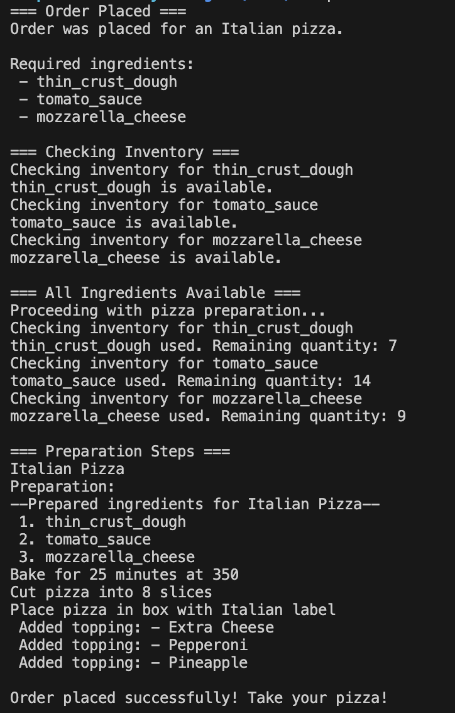
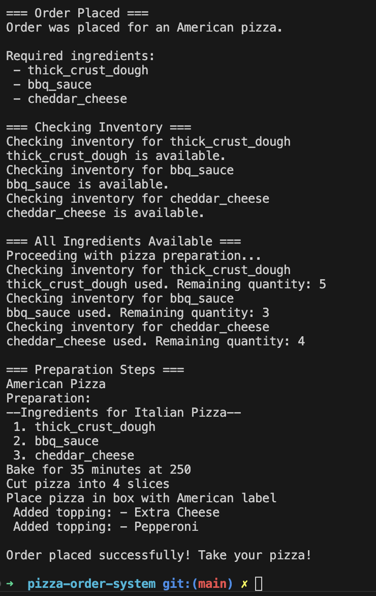

# Laboratory 3 - Pizza Ordering System 3

## Author: Maria Colta

---

## Objectives:

1.  Study and understand the Behavioral Design Patterns.

2.  As a continuation of the previous laboratory work, think about what communication between software entities might be involed in your system.

3.  Implement some additional functionalities using behavioral design patterns.

## Theory

Behavioral design patterns are a category of design patterns that focus on the interactions and communication between objects. They help define how objects collaborate and distribute responsibility among them, making it easier to manage complex control flow and communication in a system. [1
]

Here are some examples of behavioral design patterns:

- **Chain of Responsibility** - lets you pass requests along a chain of handlers. Upon receiving a request, each handler decides either to process the request or to pass it to the next handler in the chain. [2]

- **Command** - turns a request into a stand-alone object that contains all information about the request. This transformation lets you pass requests as a method arguments, delay or queue a request’s execution, and support undoable operations. [2]

- **Memento** - lets you save and restore the previous state of an object without revealing the details of its implementation. [2]

- **Iterator** - lets you traverse elements of a collection without exposing its underlying representation (list, stack, tree, etc.). [2]

- **Mediator** - lets you reduce chaotic dependencies between objects. The pattern restricts direct communications between the objects and forces them to collaborate only via a mediator object. [2]

- **Observer** - lets you define a subscription mechanism to notify multiple objects about any events that happen to the object they’re observing. [2]

- **Strategy** - lets you define a family of algorithms, put each of them into a separate class, and make their objects interchangeable. [2]

## Implementation & Used Design Patterns:

I implemented one behavioural desin pattern in this project, and I chose the Command pattern.

The instructions to run the project can be found here: [Run Project](#run-the-project)

### 1. Command Pattern

In this pizza ordering system, I used the Command pattern to execute actions like placing. I created a `Command` interface which declares an `execute()` method, and them implemented `PlaceOrderCommand` implements the interface and encapsulates the action of placing an order by interacting with the `PizzaOrderingSystem`.

The invoker which will manage all commands is `OrderManager` and it will be used inside `PizzaOrderFacade`.

```typescript
interface Command {
  execute(): void;
}
```

```typescript
class PlaceOrderCommand implements Command {
  private order: Order;
  private pizzaOrderSystem: PizzaOrderSystem;

  constructor(order: Order) {
    this.order = order;
    this.pizzaOrderSystem = PizzaOrderSystem.getInstance();
  }

  execute(): void {
    this.pizzaOrderSystem.placeOrder(this.order);
  }
}
```

```typescript
class OrderManager {
  private commandQueue: Command[] = [];
  private undoStack: Command[] = [];

  executeCommand(command: Command): void {
    command.execute();
    this.commandQueue.push(command);
    this.undoStack.push(command);
  }
}
```

Code snippet from the `PizzaOrderFacade` where `OrderManager` is used:

```typescript
  public getPizza() {
    // getting the pizza type and instantiating proper factories and builders

    // use of Command
    const placeOrderCommand = new PlaceOrderCommand(order);
    console.log("=== Order Placed ===");
    this.orderManager.executeCommand(placeOrderCommand);

    // rest of pizza creations
  }
```

## Run the project

To run the project, run the following commands:

```
cd Lab3/pizza-order-system
npm install
```

Compile the `.ts` files and run the `index.js` file:

```
npx tsc
npx ts-node dist/index.js
```

## Screenshots / Results

When running the project, we have the following output, based on the instructions from client code:





## Conclusions

The Command Pattern in this project makes the system easier to manage by separating the logic for handling actions like placing an order into separate classes. It allows us to manage each action independently while keeping the existing structure clean and modular. For example, when a user places an order, the action is encapsulated in a command object and passed to the `OrderManager`, which executes it when needed. The commands can also be extended with other actions, such as undoing an order, and those actions will be invoked using the `OrderManager` class.

This design keeps the system organized and makes it easy to add new features in the future, like modifying an order, without having to rewrite existing code.

## Bibliography

[1] https://www.geeksforgeeks.org/behavioral-design-patterns/

[2] https://refactoring.guru/design-patterns/behavioral-patterns
